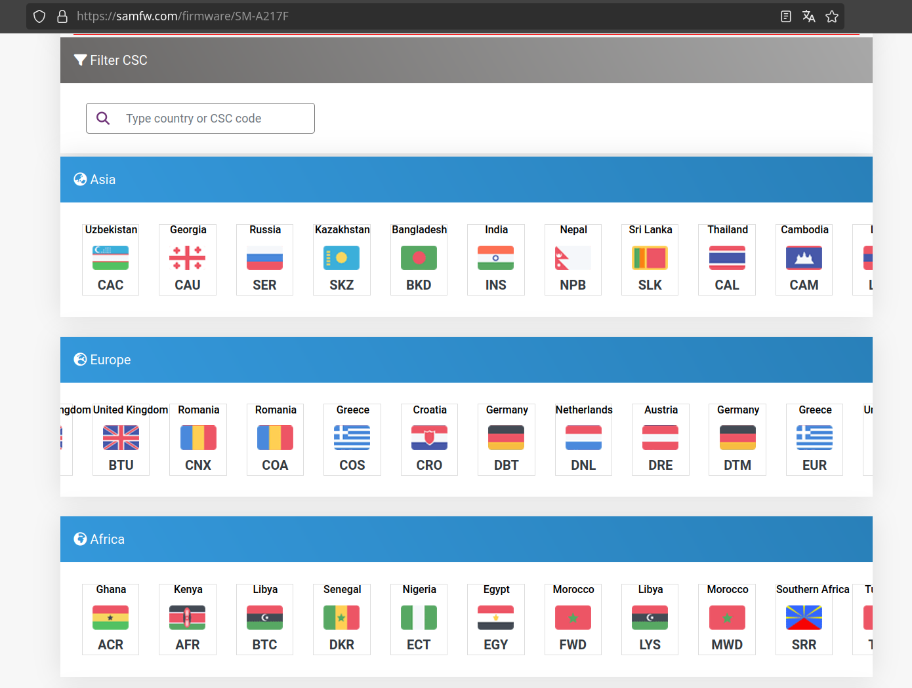
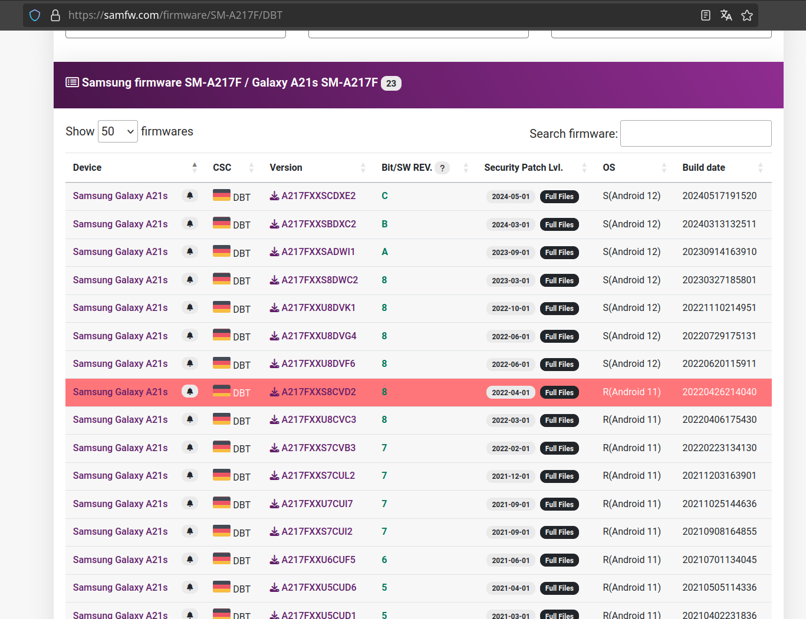
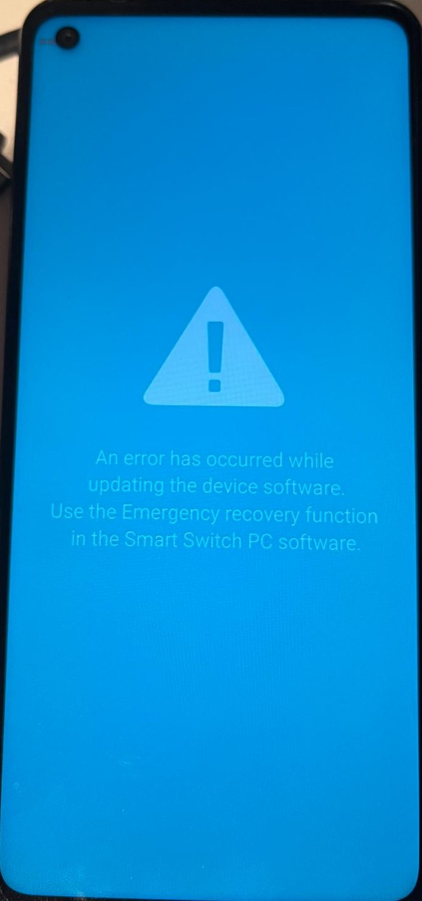

# Easy Rooting Guide for Samsung Galaxy A21s

## Prerequisites
- Samsung Galaxy A21s
- Windows PC with Odin installed
- Samsung USB drivers
- ADB toolchain

---

## Factory Reset (If You Forgot Your Password)

If you forgot your password and cannot enable OEM unlock, you'll need to perform a factory reset. Since you can't turn off your phone without entering a PIN, follow this method:

**Video guide:** https://youtu.be/BFK4Qce47vc?si=6DMd6L4TYEucYSJC

**In short:**
1. Connect a USB-C cable from your PC to your phone
2. Press and hold **Volume Down + Power** until you see the charging icon and battery percentage
3. Then press **Power + Volume Up**

---

## Step 1: Enable Developer Options

1. Go to **Settings → About phone → Software information**
2. Tap **Build number** 7 times to enable Developer options
3. Go to **Settings → Developer options**
4. Enable **OEM unlock**

---

## Step 2: Unlock Bootloader

⚠️ **Warning:** This will wipe all data on your phone.

1. Power off the phone
2. Press and hold **Volume Up + Volume Down** together
3. While holding both buttons, connect the USB-C cable to your PC
4. Follow the on-screen prompts to unlock the bootloader
5. Reconfigure your phone after the process completes

---

## Step 3: Download Device Firmware

### 3.1 Enable USB Debugging
- Go to **Settings → Developer options**
- Enable **USB debugging**

### 3.2 Gather Device Information

Run this ADB command to collect the necessary information:
```bash
adb shell "getprop ro.product.model; getprop ro.build.version.release; getprop ro.build.version.incremental; getprop ro.csc.sales_code"
```

**Sample output:**

| Property Value | Description |
|----------------|-------------|
| SM-A217F | Device model |
| 11 | Android OS version |
| A217FXXS8CVD2 | Firmware build number |
| DBT | CSC (country/carrier code) |

**To get just the CSC code:**
```bash
adb shell getprop ro.csc.sales_code
```

### 3.3 Download Firmware from SamFW

1. Enter your device model (e.g., SM-A217F)
2. Use the CSC code to filter firmware for your region/carrier
3. Match the firmware build number and Android OS version
4. Download the firmware files

 

---

## Step 4: Install Magisk and Upload Firmware

1. Install Magisk APK on your phone using `adb install` or transfer it manually
2. Upload the official firmware files to your phone
3. **Important:** Only upload the **AP_....tar.md5** file to Magisk for patching

---

## Step 5: Patch Firmware

1. Open Magisk and tap **Install**
2. Select **Select and Patch a File**
3. Choose the `AP_....tar.md5` file
4. Wait for Magisk to patch the file
5. Transfer the patched AP file (usually saved in the Download folder) back to your PC

---

## Step 6: Verify KG State (Critical Step)

1. Put the phone in **Download Mode**: Power off, then press **Volume Up + Volume Down** while connecting USB cable
2. Check the **KG state** on the screen:
   - **"Checking"** = Good! You can proceed with flashing
   - **"Prenormal"** = Connect the phone to the internet, change the date forward by 7 days, and try again

---

## Step 7: Flash with Odin

1. Open Odin on your PC
2. Load the files:
   - **AP slot:** Patched Magisk AP file
   - **BL, CP, CSC slots:** Original `.tar.md5` files from the firmware
3. In **Options**, disable **Auto Reboot**
4. Click **Start** and wait for the process to complete

---

## Troubleshooting

**If flashing appears stuck (no progress for 12–15 minutes):**

1. Disconnect the phone (you may see an error screen)

   

2. Don't panic! Flash again using the **original (unpatched) AP file** along with the other original files (BL, CP, CSC)
3. This issue is usually caused by an incorrectly patched Magisk file
4. **Important:** Keep the `.md5` and `.tar` extensions intact — Odin requires them

---

## Step 8: Complete the Installation

Once Odin shows a green **"PASS"**:

1. Disconnect the USB cable from the phone
2. Restart the phone by holding **Power + Volume Down**
3. When the screen goes black, immediately press and hold **Volume Up + Power**
4. Perform a factory reset in the recovery menu and confirm
5. Wait for the phone to reboot and complete the initial setup

---

## Step 9: Verify Root Access

1. Install Root Checker APK via `adb install` or by copying the APK to your phone
2. Open Root Checker and verify root access
3. To get an ADB shell with root privileges, grant access in Magisk when prompted

---

## 🎉 Congratulations!

This explaination is based on multiple sources, however this documents verient diese und kpmmert sich auch um trouble shooting. Also LLMs like ChatGPT, Gemini and Claude werent able to fully get this together.

- https://github.com/thefatos/galaxya21s-gsi
- https://technastic.com/fix-odin-complete-write-operation-failed-error/
- https://youtu.be/BFK4Qce47vc?si=6DMd6L4TYEucYSJC